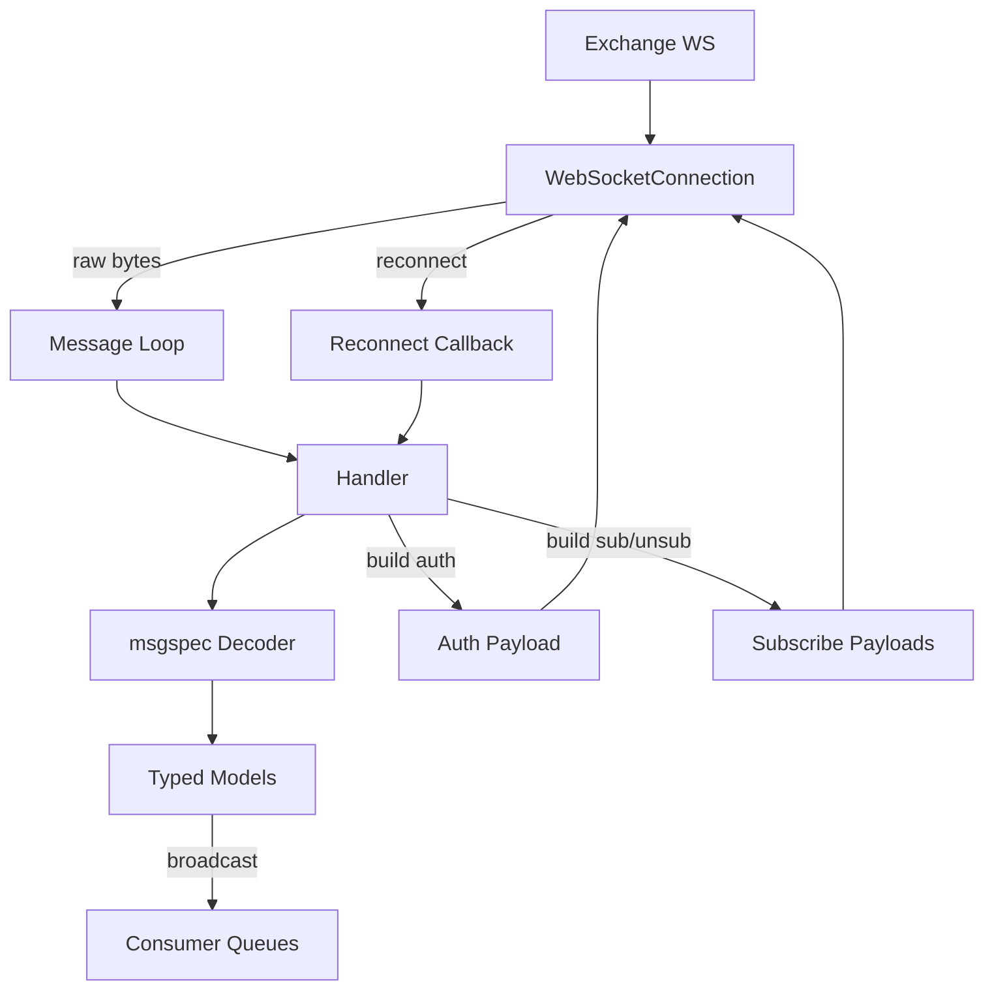
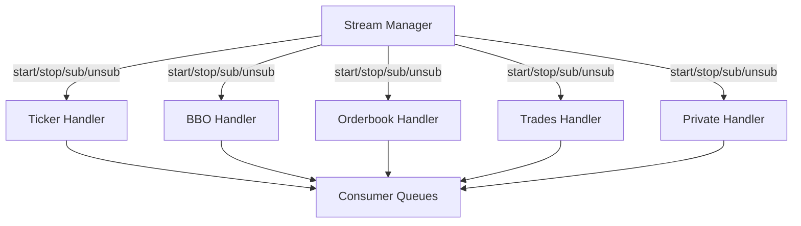
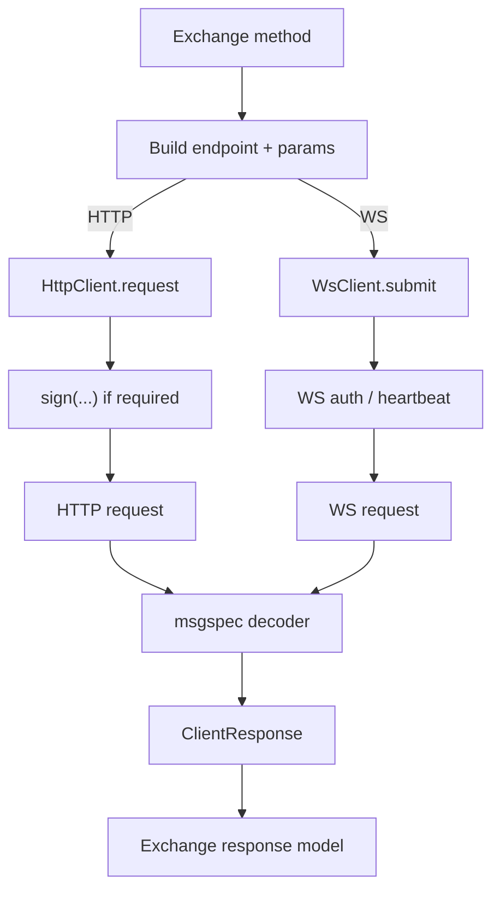
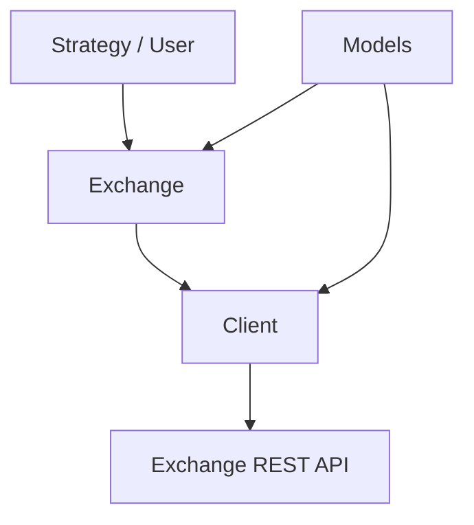

# Framework

This folder contains the exchange framework used by strategy authors and by contributors
implementing new exchange adapters. The framework is split into two interfaces: stream
(websocket ingestion) and trading (REST/order flow). Both are designed around small,
explicit components with clear contracts to keep strategy code stable and adapter logic
predictable.

## Quick map
- `framework/<exchange>/stream/`: stream models, handlers, manager
- `framework/<exchange>/trading/`: trading models, exchange, client
- `framework/base/README.md`: deeper background and rationale
- Base stream building blocks: [base/stream/](base/stream/)
- Base trading building blocks: [base/trading/](base/trading/)

## High-level architecture

### Stream interface (Mermaid flow)

The stream pipeline consumes raw websocket payloads, validates and models them, then
publishes typed state into the shared data layer. Each handler owns its own websocket
connection (market streams often run on dedicated connections, as in Binance), while the
manager coordinates subscriptions and lifecycle events. This keeps the wire protocol
isolated from strategy code while preserving low-latency updates.

Handler internal flow:

Manager + handlers (high-level):

Roles:
- Connections: owned by handlers; manage websocket lifecycle and reconnects.
- Handlers: decode, validate, and map payloads into internal models.
- Models: strict, typed representations of each payload shape.
- Manager: tracks subscriptions, starts/stops handlers, and emits lifecycle events.
- Stream interface: stable surface for strategies to subscribe and consume.

More detail: [base/stream/connection.py](base/stream/connection.py),
[base/stream/handlers.py](base/stream/handlers.py),
[base/stream/manager.py](base/stream/manager.py), and
[base/stream/models.py](base/stream/models.py). Example implementation:
[binance/stream/](binance/stream/).

### Trading interface (Mermaid flow)

The trading side exposes a strategy-facing API while isolating exchange-specific
transport and signing logic. Models define the contract, the exchange class provides
high-level operations, and the client owns low-level HTTP behavior.

Client + exchange internal flow:

High-level flow:

Data flows down for order creation/amend/cancel and back up for responses,
acknowledgements, and snapshots.

More info: [base/trading/models.py](base/trading/models.py),
[base/trading/exchange.py](base/trading/exchange.py), and
[base/trading/client.py](base/trading/client.py). Example implementation:
[binance/trading/](binance/trading/).

## Low-level design choices

### Strict payloads via msgspec

Handlers decode raw payloads into msgspec structs to enforce strict typing at the
boundary. Shape mismatches fail fast, preventing silent drift between exchange payloads
and internal state. Conversions remain localized (decode -> map -> state), which keeps
transformations explicit and auditable.

### Minimal error propagation layers

Errors are handled as close to their origin as possible. If a model/decoder raises, the
handler decides what it can normalize or retry. Known issues are converted into controlled
responses; unknown issues are re-raised to the manager/stream boundary. This keeps error
paths short and observable, without implicit recovery.

## Why a custom framework (vs CCXT)

CCXT optimizes for breadth and flexibility; this framework optimizes for strictness and
speed in a controlled execution environment. Inputs are expected to be correct and errors
should surface early, rather than being obscured. Scope is intentionally narrow (trading
and market data only), and we avoid generalized features that add overhead on the critical
path.

Adapters can still rely on official exchange clients when it improves performance or
signing correctness, but everything is normalized through a single internal API so
strategies remain consistent across exchanges. Background notes live in
[base/README.md](base/README.md).

## For contributors

Start with [base/README.md](base/README.md) to understand core concepts and tradeoffs.
Implement stream parts first (models -> handlers -> manager), then trading. Keep
interfaces minimal and keep type boundaries explicit so behavior remains easy to reason
about.
